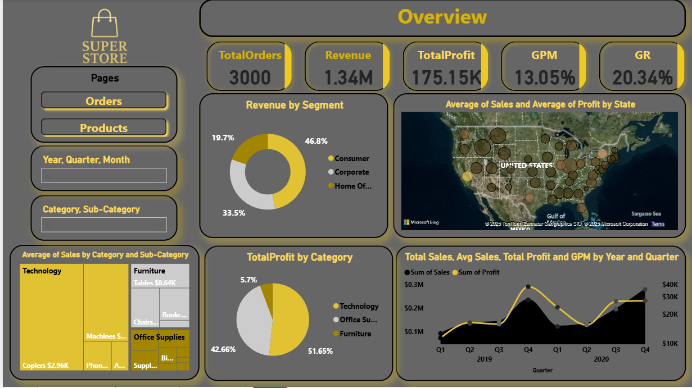
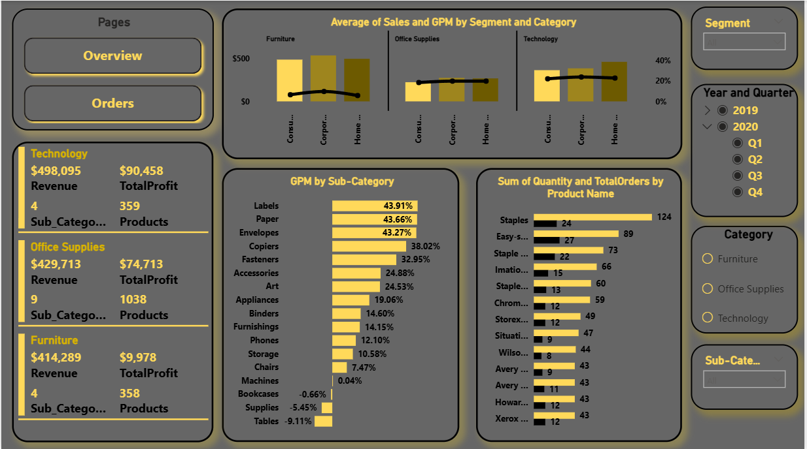
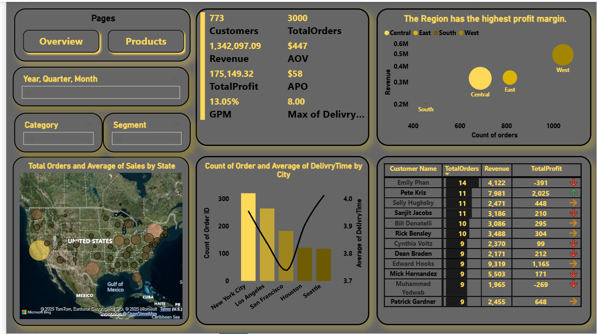

# 🏬 Super Store Analysis - Power BI Dashboard

## 📖 Overview

**Super Store Analysis** is an interactive **Power BI Dashboard** designed to analyze retail performance and uncover key business insights.  
The project demonstrates the complete BI lifecycle — from **data cleaning and modeling** to **DAX calculations and dashboard design** — turning raw flat data into a powerful analytical model.

---

## 🎯 Objectives

- Transform a **flat sales dataset** into a structured data model.  
- Build **KPIs** to monitor sales, profit, and customer performance.  
- Analyze **regional, categorical, and customer-level trends**.  
- Provide **dynamic visuals** for easy business interpretation.

---

## 🧹 Data Preparation & Modeling

### 1️⃣ Data Source
The dataset was originally a **flat table** containing:
- Order details  
- Product information  
- Customer data  
- Geographic location  
- Financial metrics (Sales, Profit, Discount, Quantity)  

### 2️⃣ Data Cleaning
Using **Power Query**, the following transformations were applied:
- Removed duplicates and null values  
- Fixed incorrect data types (Date, Currency, Text)  
- Renamed columns for consistency  
- Extracted new fields: *Year*, *Quarter*, *Month*  

### 3️⃣ Data Modeling (Star Schema)
To ensure high performance and scalability, the data was restructured into a **Star Schema** model:

#### 🔸 Fact Table
- `Fact_Sales`: Contains quantitative measures such as *Sales, Profit, Quantity, Discount, Order ID, Customer ID, Product ID, and Date Key.*

#### 🔸 Dimension Tables
- `Dim_Date` – Hierarchical time structure (Year, Quarter, Month, Day)  
- `Dim_Product` – Product, Sub-Category, and Category details  
- `Dim_Customer` – Customer Name and Segment  


✅ Relationships were created in a **one-to-many** structure between dimension tables and the fact table.

---

## 🧮 DAX Measures (Key Calculations)

```DAX
-- Total Orders
TotalOrders = COUNTROWS('Fact_Sales')

-- Total Revenue
Revenue = SUM('Fact_Sales'[Sales])

-- Total Profit
TotalProfit = SUM('Fact_Sales'[Profit])

-- Gross Profit Margin (GPM)
GPM = DIVIDE([TotalProfit], [Revenue], 0)

-- Growth Rate (GR)
GR = 
VAR PrevPeriod = CALCULATE([Revenue], DATEADD('Dim_Date'[Date], -1, YEAR))
RETURN DIVIDE([Revenue] - PrevPeriod, PrevPeriod, 0)

-- Average Order Value (AOV)
AOV = DIVIDE([Revenue], [TotalOrders], 0)

-- Average Profit per Order (APO)
APO = DIVIDE([TotalProfit], [TotalOrders], 0)
```

These DAX measures drive all KPIs and visuals within the report.

---

## 🖼️ Dashboard Preview

### 🔹 Overview Page  


### 🔹 Orders Page  


### 🔹 Products Page  


---

## 💡 Key Insights

- **Central Region** achieved the **highest profit margin**.  
- **Technology** category contributed the most to total profit.  
- **Consumer Segment** generated nearly half of total revenue.  
- **Labels, Paper, and Envelopes** sub-categories had the best profit margins.  
- **Tables and Supplies** underperformed compared to other categories.  
- Clear **regional and state-level trends** highlight geographic performance differences.  

---

## ⚙️ Tools & Technologies

| Tool | Purpose |
|------|----------|
| 🧩 **Power BI Desktop** | Data modeling and visualization |
| 🧮 **Power Query (M Language)** | Data cleaning and transformation |
| 🧠 **DAX** | Measures, KPIs, and time intelligence |
| 📊 **Excel / CSV** | Source dataset |

---

## 📁 Project Structure

| File | Description |
|------|--------------|
| `SuperStore.pbix` | Main Power BI dashboard file |
| `README.md` | Project documentation |
| `Dataset.xlsx` | Original flat table data |

---

## 🚀 How to Use

1. Clone or download the repository:
   ```bash
   git clone https://github.com/Abdallah101290/Super-Store-Analysis.git
   ```
2. Open the `.pbix` file in **Power BI Desktop**.  
3. Refresh the dataset if needed.  
4. Explore the visuals interactively using slicers for year, category, and segment.

---

## 🧭 Future Enhancements

- 📈 Add **forecasting visuals** to predict future sales & profits.  
- 👥 Build **customer segmentation dashboards** for marketing insights.  
- 🔐 Implement **Row-Level Security (RLS)** for user-level data access.  
- 🔄 Automate data refresh via **Power BI Service** and scheduled updates.  
- 💬 Include **dynamic tooltips** for richer contextual insights.

---

## 👤 Author

**[Abdallah Elshokey](https://www.linkedin.com/in/abdallah-elshokey-230b95225/)**  
💼 *Power BI Developer | Data Analyst*  

> Passionate about transforming raw data into meaningful and actionable insights.  
> Skilled in data modeling, DAX, and dashboard storytelling.

📍 Connect with me on [LinkedIn](https://www.linkedin.com/in/abdallah-elshokey-230b95225/)

---

## ⭐ Feedback

If you find this project helpful, please **⭐ star the repository** and share your feedback on LinkedIn!  
Your support motivates continued learning and innovation 🚀
